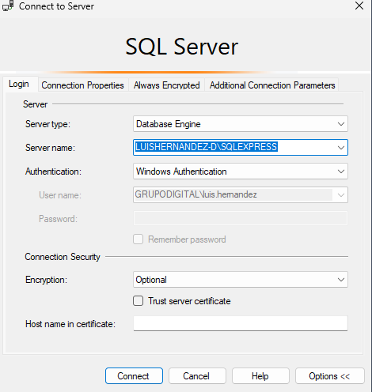

Catalogo de productos
===========

¡Bienvenido al proyecto Catalogo de productos! Esta aplicación hecha en .Net 9 y React con vite está diseñada para gestionar los productos de un catalogo.

Requerimientos
------------

*   **Sql Server Management Studio**
*   **NodeJS >= 12**
*   **.Net 9**

Guia de instalacion
------------------

Siga estos pasos para poner en marcha el proyecto en su máquina local.


### 1\. Clone el repositorio

Clona el repositorio del proyecto desde GitHub a tu máquina local en ingresa al proyecto.

```bash
git clone https://github.com/Luuchoh/Grupo_Alianza_PT.git 
cd Grupo_Alianza_PT/
```


### 2\. Instalar dependencias para el frontend

instala los paquete requeridos de React con `pnpm` puedes instalarlo siguiendo las instrucciones como se muestran [aqui](https://pnpm.io/es/installation).

```bash
cd frontend/
pnpm install
```

Espera hasta que se hayan descargado completamente.


### 3\. Configura las variables de entorno

Crea un archivo `.env` en la raíz del proyecto. Puede utilizar `.env.example` como plantilla

Aqui un ejemplo:

```bash
echo "VITE_SERVER=https://localhost:5051/" > .env
```

Actualice el archivo `.env` con sus credenciales de base de datos y otras configuraciones necesarias


### 4\. Configurar la base de datos

Antes de hacerlo debes contar con las herramientas de EntityFramework `dotnet ef` puede instalarlo desde [aqui](https://learn.microsoft.com/es-es/ef/core/cli/dotnet).

Abres SQL Server Management y copias el servername e ingresas al gestor.



Te diriges manualmente a la carpeta backend/src/WebAPI e ingresas al archivo appsettings.json y cambias el nombre del servidor por el que copiaste en el anterior paso.

```C#
{
  "Logging": {
    "LogLevel": {
      "Default": "Information",
      "Microsoft.AspNetCore": "Warning"
    }
  },
  "AllowedHosts": "*",
  "ConnectionStrings": {
    "DefaultConnection": "Server=TU_SERVER_NAME;Database=CatalogoDB;Trusted_Connection=True;TrustServerCertificate=True"
  }
}
```

Aplica las migraciones.

```bash
cd ../backend/
dotnet ef database update --project src/Infrastructure --startup-project src/WebAPI
```


### 5\. Ejecutar el servidor backend de desarrollo

Inicia el servidor de desarrollo .Net.

```bash
dotnet build
dotnet run --project src/WebAPI
```

Acceda al proyecto navegando hasta `http://localhost:5051/swagger/index.html` en su navegador web.


### 6\. Ejecutar el servidor de frontend de desarrollo

Abre una nueva terminal

Inicia el servidor de desarrollo React.

```bash
pnpm run dev
```

Acceda al proyecto navegando hasta `http://localhost:3000` en su navegador web.

Project Structure
-----------------

*   **product**: Gestiona todo lo relacionado con los productos.
